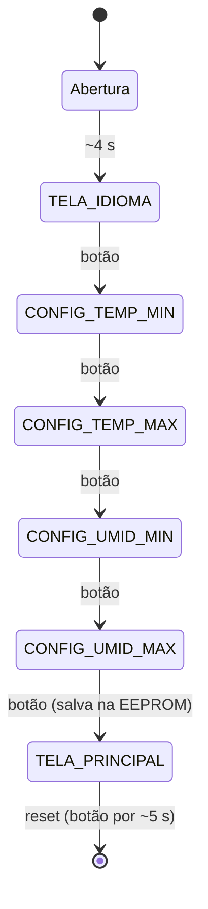

# 🌽 Corn Harvest – CH Monitor

**Data logger para monitoramento ambiental de milharais**

Dispositivo baseado em Arduino Uno R3 que mede **temperatura**, **umidade relativa do ar** e **luminosidade**, exibe os dados em um display LCD, aciona alertas visuais e sonoros quando alguma condição sai da faixa configurada e registra as ocorrências na memória EEPROM com data e hora.

> Projeto desenvolvido para a disciplina do Prof. Dr. Fábio Henrique Cabrini – **FESA**.

| Recurso | Link |
| --- | --- |
| 🎬 Pitch de apresentação (YouTube) | https://youtu.be/eKgZ9NB-eH8 |
| 🧪 Simulação no Wokwi | https://wokwi.com/projects/476716640789315585 |

---

## Sumário

1. [Objetivo](#1-objetivo)
2. [Funcionalidades](#2-funcionalidades)
3. [Especificações técnicas](#3-especificações-técnicas)
4. [Lista de materiais](#4-lista-de-materiais)
5. [Mapa de pinos e ligações](#5-mapa-de-pinos-e-ligações)
6. [Software](#6-software)
7. [Manual de operação](#7-manual-de-operação)
8. [Sistema de alarme](#8-sistema-de-alarme)
9. [Histórico na EEPROM](#9-histórico-na-eeprom)
10. [Consulta pela Serial](#10-consulta-pela-serial)
11. [Uso em países da América do Sul e do Norte](#11-uso-em-países-da-américa-do-sul-e-do-norte)
12. [Solução de problemas](#12-solução-de-problemas)
13. [Cuidados e limitações conhecidas](#13-cuidados-e-limitações-conhecidas)
14. [Equipe](#14-equipe)

---

## 1. Objetivo

Criar um dispositivo de registro de dados (*data logger*) dedicado ao monitoramento das condições ambientais em espaços controlados, aplicado ao acompanhamento de **milharais** (lavoura e armazenamento). O equipamento acompanha temperatura, umidade relativa do ar e luminosidade, alerta o operador quando algum valor foge da faixa desejada e mantém um histórico das ocorrências.

## 2. Funcionalidades

- Medição de temperatura, umidade relativa e luminosidade.
- Display LCD 16×2 I2C com **3 telas alternadas a cada ~3 s** (data/hora, temperatura/umidade, luminosidade).
- **Limites configuráveis** de temperatura e umidade, salvos na EEPROM (permanecem após desligar).
- **LED RGB** de status: azul (menus), verde (tudo OK) e vermelho (alarme).
- **Buzzer** intermitente durante o alarme.
- **Histórico de até 100 registros** (horário, temperatura e umidade) na EEPROM, em buffer circular.
- Consulta do histórico via **Serial (9600 baud)**.
- **Relógio de tempo real (RTC DS1307)** para timestamps precisos.
- Interface em **3 idiomas** (Português, Espanhol e Inglês), com conversão automática para °F em Inglês.
- **Reset por hardware/software**: botão do joystick pressionado por ~5 s.
- Interface simples e intuitiva, com um único joystick (eixo Y + botão).

## 3. Especificações técnicas

### Características gerais

| Característica | Especificação |
| --- | --- |
| Microcontrolador | Arduino Uno R3 |
| Display | LCD 16×2 com interface I2C (endereço `0x27`) |
| Sensor de temperatura e umidade | DHT11 |
| Sensor de luminosidade | LDR + resistor de 10 kΩ (divisor de tensão) |
| Relógio | RTC DS1307 (I2C) |
| Memória | EEPROM interna do ATmega328P (1 KB) |
| Histórico | Até 100 registros de 8 bytes |
| Comunicação Serial | 9600 baud |
| Idiomas | Português / Espanhol / Inglês |
| Alimentação | Bateria de 9 V com suporte |
| Troca de telas | Aprox. 3 segundos |
| Reset | Botão pressionado por aprox. 5 segundos |

### Unidades de medida, faixas e precisão

| Grandeza | Unidade | Faixa de medição do sensor | Precisão / resolução do sensor | Faixa configurável no CH Monitor |
| --- | --- | --- | --- | --- |
| Temperatura | °C (°F em Inglês) | 0 a 50 °C (DHT11) | ±2 °C / 1 °C | 0 a 50 °C (32 a 122 °F), passo de 1 °C (1 °F em Inglês) |
| Umidade relativa | % UR | 20 a 80 % (DHT11) | ±5 % UR / 1 % | 20 a 80 %, passo de 1 % |
| Luminosidade | Valor do ADC (adimensional) | 0 a 1023 (ADC de 10 bits, 0–5 V) | Resolução de ~4,9 mV por passo | **Fixa**: alarme se < 100 ou > 900 |

> A leitura de luminosidade é o valor bruto do conversor analógico-digital: valores **menores indicam ambiente mais escuro** ou mais claro conforme a montagem do divisor de tensão com o LDR. A precisão depende do LDR utilizado, que não é um sensor calibrado.

> Os valores de precisão do DHT11 são os de datasheet. No simulador Wokwi o projeto utiliza o **DHT22** (veja a [seção 6](#6-software)).

### Limites de alarme

| Parâmetro | Faixa de ajuste | Valor padrão |
| --- | --- | --- |
| Temperatura mínima | 0–50 °C | 20 °C |
| Temperatura máxima | 0–50 °C | 30 °C |
| Umidade mínima | 20–80 % | 30 % |
| Umidade máxima | 20–80 % | 60 % |
| Luminosidade | Fixa | 100 a 900 (ADC) |

## 4. Lista de materiais

| Qtd. | Item |
| --- | --- |
| 1 | Arduino Uno R3 |
| 1 | LDR + resistor de 10 kΩ |
| 1 | DHT11 (sensor de temperatura e umidade) |
| 1 | LCD 16×2 com módulo I2C |
| 1 | RTC (DS1307) |
| 1 | Buzzer passivo |
| 1 | Joystick analógico (eixo Y e botão) |
| 1 | LED RGB + resistores |
| 1 | Bateria de 9 V + suporte |
| — | Protoboard, jumpers, LEDs e resistores |

## 5. Mapa de pinos e ligações

| Componente | Pino do Arduino | Observação |
| --- | --- | --- |
| DHT11 (dados) | `D2` | Alimentação 5 V / GND |
| LDR (divisor de tensão) | `A0` | Com resistor de 10 kΩ |
| Joystick – eixo Y | `A1` | Cima / baixo |
| Joystick – botão (SW) | `D6` | `INPUT_PULLUP` (aciona em LOW) |
| Buzzer | `D8` | Saída com `tone()` |
| LED RGB – vermelho | `D9` | PWM |
| LED RGB – verde | `D10` | PWM |
| LED RGB – azul | `D11` | PWM |
| LCD I2C e RTC DS1307 | `A4` (SDA) / `A5` (SCL) | Barramento I2C compartilhado |
| LED interno | `LED_BUILTIN` | Pisca a cada novo minuto |

## 6. Software

### Bibliotecas necessárias

- `LiquidCrystal_I2C`
- `RTClib` (Adafruit)
- `DHT sensor library` (Adafruit) e `Adafruit Unified Sensor`
- `Wire` e `EEPROM` (já incluídas na IDE do Arduino)

### Opções de compilação

No início do código-fonte:

| Constante | Valor padrão | Função |
| --- | --- | --- |
| `LOG_OPTION` | `0` | `1` imprime o log da EEPROM continuamente no loop |
| `SERIAL_OPTION` | `0` | `1` envia o horário atual continuamente pela Serial |
| `UTC_OFFSET` | `0` | Ajuste de fuso horário, em horas |
| `DHTTYPE` | `DHT22` | **Use `DHT11` no hardware real**; `DHT22` é usado no Wokwi |

> ⚠️ **Antes de gravar na placa física, altere `DHTTYPE` para `DHT11`.**

### Como executar

**Simulador (Wokwi):** abra o projeto no link da simulação e inicie a execução.

**Hardware real:**

1. Monte o circuito conforme o [mapa de pinos](#5-mapa-de-pinos-e-ligações).
2. Instale as bibliotecas listadas acima.
3. Altere `DHTTYPE` para `DHT11`.
4. Abra o código na IDE do Arduino, selecione a placa **Arduino Uno** e faça o upload.

### Estados do sistema



## 7. Manual de operação

### Guia rápido

| Indicador | Significado |
| --- | --- |
| 🔵 LED azul | Seleção de idioma e configuração |
| 🟢 LED verde | Valores dentro das faixas configuradas |
| 🔴 LED vermelho | Pelo menos uma condição está fora da faixa |
| 🔔 Buzzer | Alerta sonoro durante uma condição de alarme |

### Passo a passo

1. **Ligue o aparelho** e aguarde a tela de abertura **CH MONITOR** (~4 s).
2. **Selecione o idioma** movendo o joystick para cima ou para baixo e pressione o botão para confirmar.
   - Em **Inglês** a temperatura é exibida em Fahrenheit (°F); em Português e Espanhol, em Celsius (°C).
3. **Configure a temperatura mínima** e confirme com o botão.
4. **Configure a temperatura máxima** e confirme.
5. **Configure a umidade mínima** e confirme.
6. **Configure a umidade máxima** e confirme. Ao confirmar este último parâmetro, os quatro limites são **gravados na EEPROM** e o monitoramento começa.
7. **Acompanhe o monitoramento**: o LCD alterna a cada ~3 s entre as três telas.

> No ajuste dos valores, mover o joystick **para cima aumenta** e **para baixo diminui** o valor, em passos de 1 unidade.

### Telas de monitoramento

| Tela | Informação |
| --- | --- |
| 1 | Data e hora |
| 2 | Temperatura e umidade |
| 3 | Luminosidade |

### Reinicialização

1. Mantenha o botão do joystick pressionado.
2. Após ~5 segundos, o buzzer emite um aviso sonoro.
3. O Arduino é reiniciado e a tela de seleção de idioma é exibida novamente.

> **Persistência:** os quatro limites de temperatura e umidade permanecem salvos após desligar o aparelho. O **idioma não é armazenado** e volta à opção inicial após cada reinicialização.

## 8. Sistema de alarme

| Condição | LED RGB | Buzzer |
| --- | --- | --- |
| Tudo dentro da faixa | Verde | Desligado |
| Algum valor fora da faixa | Vermelho | Intermitente (500 ms ligado / 500 ms desligado) |

O alarme considera **temperatura, umidade e luminosidade**. A luminosidade tem limites fixos: abaixo de 100 ou acima de 900 é considerada fora da faixa.

## 9. Histórico na EEPROM

- Capacidade: **100 registros**, em buffer circular (ao chegar ao fim, a gravação volta ao início e substitui os mais antigos).
- Um registro é gravado **no máximo uma vez por minuto**, quando temperatura **ou** umidade estiverem fora da faixa. A luminosidade participa do alarme, mas **não é gravada** no histórico.
- A cada novo minuto, o LED interno da placa pisca brevemente.

**Mapa de memória**

| Endereço | Conteúdo |
| --- | --- |
| 0 | Marcador de validade (`0x414C`) |
| 2 | Temperatura mínima (float) |
| 6 | Temperatura máxima (float) |
| 10 | Umidade mínima (float) |
| 14 | Umidade máxima (float) |
| 20 a 819 | Registros do histórico (100 × 8 bytes) |

**Formato de cada registro (8 bytes)**

| Bytes | Campo | Descrição |
| --- | --- | --- |
| 0–3 | Timestamp | Horário Unix (segundos) |
| 4–5 | Temperatura | Valor em °C × 100 |
| 6–7 | Umidade | Valor em % × 100 |

## 10. Consulta pela Serial

1. Conecte o aparelho ao computador por USB.
2. Abra um monitor Serial a **9600 baud**.
3. Envie `L` ou `l`.

O sistema imprime todos os registros encontrados na EEPROM, no formato:

```
--- DADOS GRAVADOS NA EEPROM ---
Timestamp               Temperatura     Umidade
2026-05-20T14:32:00     31.00 C         45.00 %
--------------------------------
```

A temperatura do histórico é sempre exibida em °C, independentemente do idioma selecionado.

## 11. Uso em países da América do Sul e do Norte

- **Idiomas:** Português, Espanhol e Inglês cobrem os principais idiomas das duas regiões.
- **Unidades:** em Inglês, a temperatura é exibida em °F (padrão nos EUA), e nos demais idiomas em °C.
- **Fuso horário:** o RTC guarda o horário local e o parâmetro `UTC_OFFSET` permite ajustá-lo no código-fonte (padrão `0`).
- **Alimentação:** bateria de 9 V, sem dependência da rede elétrica local.

## 12. Solução de problemas

| Problema | Verificação |
| --- | --- |
| LCD sem imagem | Alimentação, cabos e endereço I2C (`0x27` ou `0x3F`) |
| DHT11 sem leitura correta | Sensor, alimentação, conexão do pino de dados e `DHTTYPE` |
| LDR com leitura inadequada | Sensor, resistor de 10 kΩ e conexão elétrica |
| Buzzer sem alarme | Conexão e condição de alarme |
| LED RGB sem mudança | Conexões dos canais R, G e B |
| Configurações voltando ao padrão | Reconfigure e confirme as quatro etapas |
| Hora incorreta | RTC (bateria do módulo) e configuração de horário |

## 13. Cuidados e limitações conhecidas

**Cuidados**

- Proteja o circuito contra água e umidade excessiva.
- Evite curtos-circuitos.
- Desligue a alimentação antes de qualquer alteração elétrica.

**Limitações**

- O idioma selecionado não é salvo na EEPROM.
- A posição de gravação do histórico não é salva: após um reinício, novos registros voltam a ser gravados a partir do início da área reservada.
- A faixa de luminosidade é fixa no código (100 a 900).
- Se o RTC não estiver em funcionamento, o horário é ajustado automaticamente para a data e hora da compilação do código.

## 14. Equipe

| Nome | RA |
| --- | --- |
|Arthur Camisotti Carvalho | 082240001 |
| Gabriel Lima de Sousa | 082240004 |
| João Vitor Meneses Viana | 082240008 |
| Lucas de Melo Chaves | 082240022 |

---
## 15. Imagens

### Visão Geral do Data Logger:


### Componentes internos:


### Construção do projeto:


### Integrantes do Projeto com Data Logger:


---
Corn Harvest • FESA
